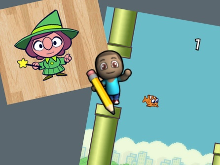

# Code.org

[Code.org](https://studio.code.org/) has a collection of online courses and activities to teach the basics of programming.  The bulk of the resources there use block based programming.

This selection of courses is a great starting point (the links below allow you to join the Porirua CoderDojo group at code.org):

## Early readers 4-6
 Start with the [Hour of Code Course 1](http://learn.code.org/join/QVUYOC)

## New coders 6+
 Start with the [Hour of Code Course 2](http://learn.code.org/join/HPXZFK)
