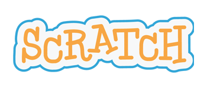

Scratch is a great way to try out programming using blocks (like code.org), and allows you to design and move characters around on screen to create games and animations.

## Resources
There are some great mini-projects to try out at:
* [Code Club](https://codeclubprojects.org/en-GB/scratch/)
* [CoderDojo](http://kata.coderdojo.com/wiki/Scratch_Path)

We have a selection of these courses/projects printed out to try, if you can't see them just ask one of the mentors.
