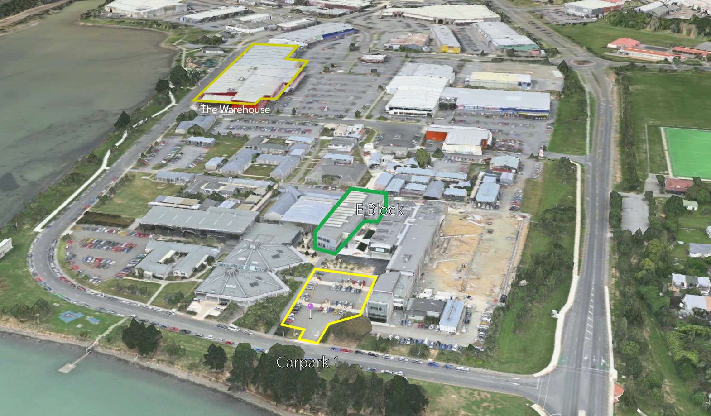

# What's your Superpower? 
## Learn to code with CoderDojo at Whitireia!  

  

Interested in coding, but not sure how to tell an Android from an Arduino? Keen to get started with hacking, but unsure where to start? Then our **free 2 hour introduction to Coding** sessions are for you!

As part of [Tech Week 2017](http://techweek.co.nz/), and in association with [Whitireia](http://www.whitireia.ac.nz/Pages/home.aspx) and [Porirua City Council](http://pcc.govt.nz/), we're running two free Introduction to Coding sessions aimed at Year 10-13's.

Stuff we will look at:

- Get started on an introduction to programming, creating a simple 2 player game, deploying a live website using Jekyll, create a Flappy Bird clone, or start learning python!
- Have a go with [MIT's App Inventor 2](http://appinventor.mit.edu/explore/ai2/beginner-videos.html), and develop and install an app on an Android phone.

[On the day](techweek2017-on-the-day)

Event dates:

- Thursday 11 May 2017, 4pm - 6pm.
- Friday 12 May 2017, 4pm - 6pm.

You bring:

- A laptop if you have one.
- An Android mobile phone, if you have one and would like to use App Inventor.

We'll bring:

- Pizza and soft drinks.
- We've got some [tiny computer](https://www.raspberrypi.org/blog/raspberry-pi-zero-w-joins-family/) spot prizes to give to away to 4 lucky participants - [register](https://www.eventfinda.co.nz/2017/introduction-to-coding-with-coderdojo-at-whitireia/porirua-mana) to be in with a chance to win!

Tickets can be obtained from [Eventfinda](https://www.eventfinda.co.nz/2017/introduction-to-coding-with-coderdojo-at-whitireia/porirua-mana)

## Location:

E Block Whitireia Main Campus Wineera Drive Elsdon

[(Click for larger copy)](resources/images/Map.png)

([Campus map](http://www.whitireia.ac.nz/about/Documents/Porirua_Campus_Map_2013.pdf))

## Thanks to our Sponsors:

[Porirua City Council](http://pcc.govt.nz/) - Food & drink, and prizes

[Whitireia](http://www.whitireia.ac.nz/Pages/home.aspx) - Venue and computing resources

[edit](https://github.com/CoderDojo-Porirua/CoderDojo-Porirua.github.io/edit/master/techweek2017.md)
